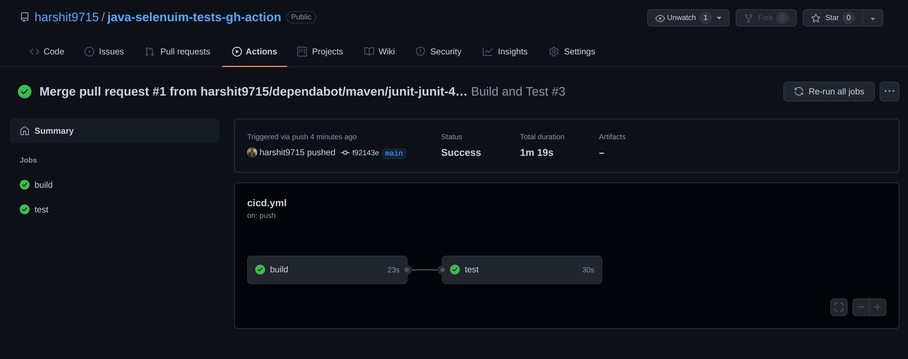

# java-selenuim-tests-gh-action

An example project of selenium using ChromeWebDriver running automated tests on github action runners.

## Prerequisites

* Have [java](http://www.oracle.com/technetwork/java/javase/downloads/index.html) installed
* Have [maven](http://maven.apache.org/) installed

## Execute automation tests

```bash
mvn clean test
```

The result looks as following:



## LICENSE

[MIT License](https://raw.githubusercontent.com/harshit9715/java-selenuim-tests-gh-action/master/LICENSE)
